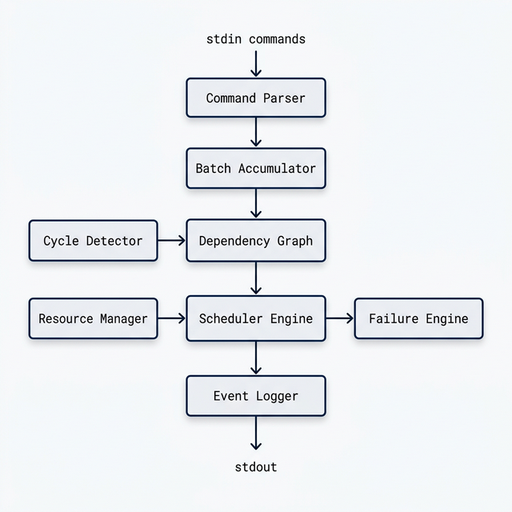
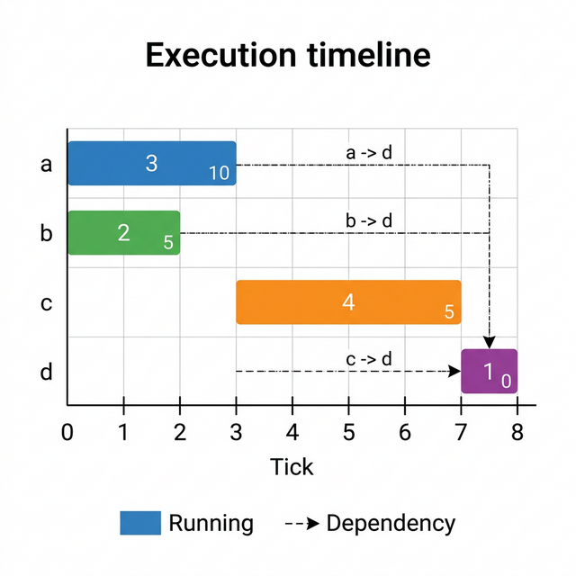
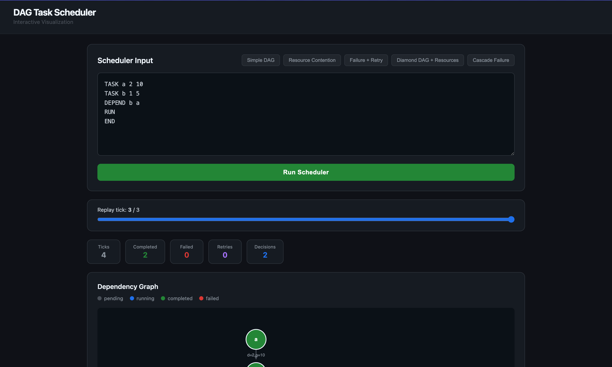
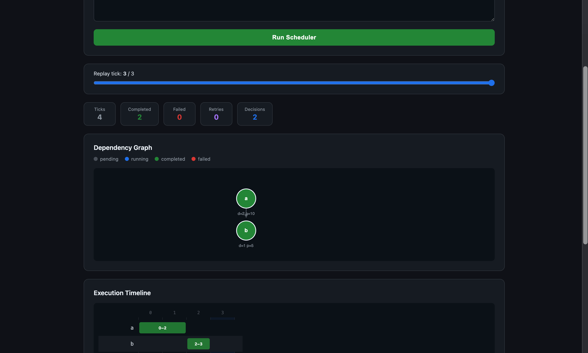
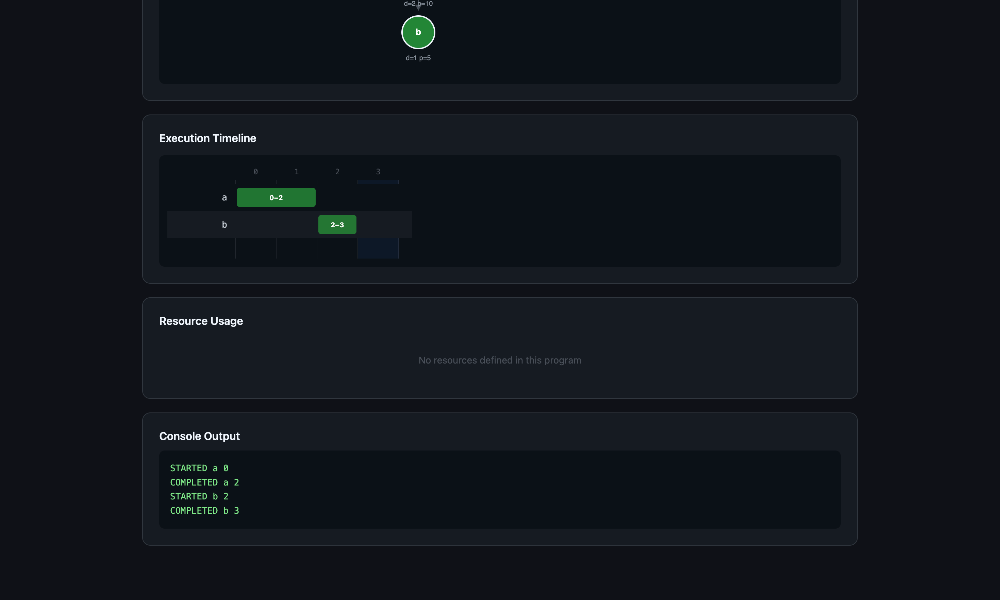

# DAG Task Scheduler

**Purvansh Sahu** | Roll No. 10169 | purvansh.23bcs10169@sst.scaler.com

[GitHub Repository](https://github.com/purvanshh/Task-Scheduler-Purvansh-Sahu-10169)

---

A production-quality deterministic task scheduler that simulates DAG-based execution with dependency management, resource constraints, priority scheduling, failure handling, and retry logic.

## Motivation

Task scheduling with dependency graphs appears in many real systems:

- **Build systems** (Bazel, Make) — compile targets with inter-file dependencies
- **Workflow engines** (Airflow, Prefect) — orchestrate multi-step data pipelines
- **Distributed job schedulers** (Kubernetes, Nomad) — manage containerized workloads
- **CI/CD pipelines** (GitHub Actions, Jenkins) — run test/build/deploy stages in order

This project explores how such systems can be implemented with deterministic tick-based simulation while guaranteeing correctness under complex failure and resource scenarios.

## Architecture



```
         stdin commands
               │
               ▼
        Command Parser ──── Parses TASK, DEPEND, RESOURCE, REQUIRE, FAIL, RETRY
               │
               ▼
       Batch Accumulator ── Collects definitions until RUN
               │
               ▼
       Dependency Graph ──┬─ Cycle Detector (3-color DFS → Tarjan SCC → lex-path)
               │          └─ Topological Sort (Kahn's + min-heap)
               ▼
       Scheduler Engine ──┬─ Resource Manager (atomic acquire/release)
               │          └─ Failure Engine (fail-on-start, retry, BFS cascade)
               ▼
         Event Logger ──── Deterministic event ordering per tick
               │
               ▼
            stdout
```

## Scheduling Example

Given this input with resource constraints:
```
TASK alpha 3 10       # duration=3, priority=10
TASK beta  2 5        # duration=2, priority=5
TASK gamma 4 5        # duration=4, priority=5
TASK delta 1 0        # duration=1, priority=0
DEPEND delta alpha
DEPEND delta beta
RESOURCE cpu 2
REQUIRE alpha cpu 1
REQUIRE beta cpu 1
REQUIRE gamma cpu 2
REQUIRE delta cpu 1
RUN
```

**Execution timeline:**



```
  Tick:  0   1   2   3   4   5   6   7
  alpha: ████████████
  beta:  ████████
  gamma:             ████████████████
  delta:                             ████
```

`alpha` (priority 10) and `beta` (priority 5) start together — they each need 1 cpu out of 2 available. `gamma` needs 2 cpus, so it waits until both finish. `delta` depends on `alpha` and `beta`, and waits for `gamma` to release cpus.

## Project Overview

This scheduler reads task definitions and commands from stdin, then simulates tick-by-tick execution producing deterministic event output. It handles:

- **Dependency graphs** — tasks wait for all dependencies to complete before starting
- **Cycle detection** — reports the lexicographically smallest cycle in the dependency graph
- **Resource constraints** — shared resource pools with capacity limits and atomic allocation
- **Priority scheduling** — higher-priority tasks are scheduled first, alphabetical tie-breaking
- **Failure injection** — tasks can be marked to fail on their first execution attempt
- **Retry logic** — failed tasks can retry, with deferred retry when resources are unavailable
- **Dependency cascade** — permanent failure propagates to all transitive dependents

## Repository Structure

```
├── src/
│   └── scheduler.py              # Main scheduler implementation
├── demo/                         # Interactive web-based visualization
│   ├── backend/
│   │   └── server.py             # FastAPI server (POST /run)
│   ├── frontend/
│   │   ├── src/
│   │   │   ├── App.jsx           # Dashboard shell, metrics, tick slider
│   │   │   ├── SchedulerInput.jsx # Text area + preset examples
│   │   │   ├── GraphView.jsx     # Canvas-rendered dependency graph
│   │   │   ├── TimelineView.jsx  # SVG Gantt chart
│   │   │   ├── ResourceChart.jsx # Recharts area chart
│   │   │   └── TraceParser.js    # Event → visualization transforms
│   │   ├── index.html
│   │   ├── vite.config.js
│   │   └── package.json
│   └── README.md
├── tests/
│   ├── public/                   # 5 provided public tests
│   ├── custom/                   # 30 custom scenario tests
│   ├── brutal/                   # 35 adversarial tests
│   ├── professor/                # 30 race-condition tests
│   ├── edge/                     # 50 advanced edge case tests
│   ├── fuzz/                     # Property-based fuzz tester
│   │   └── fuzz_scheduler.py
│   └── stress/                   # Large-scale stress tests
│       ├── generate_stress.py
│       └── run_stress.py
├── tools/
│   ├── visualize.py              # CLI dependency graph + timeline visualization
│   └── check_determinism.py      # Determinism verification (N runs, hash compare)
├── grader/
│   ├── grade.sh                  # Diff-based test runner
│   ├── run_solution.sh           # Solution runner with timeout
│   └── grader.py                 # Categorical grader with scoring
├── docs/
│   ├── architecture.md           # System architecture and data flow
│   ├── algorithms.md             # Algorithm descriptions and complexity
│   └── design-decisions.md       # Design rationale for key decisions
├── Makefile                      # Build targets for all operations
└── README.md
```

## Command Interface

| Command | Description |
|---------|-------------|
| `TASK <id> <duration> [priority]` | Define a task (priority defaults to 0) |
| `DEPEND <task> <dependency>` | Add a dependency edge |
| `RESOURCE <name> <capacity>` | Define a shared resource pool |
| `REQUIRE <task> <resource> <amount>` | Task requires resource units |
| `FAIL <task>` | Mark task to fail on first attempt |
| `RETRY <task> <count>` | Set retry count for a failed task |
| `RUN` | Execute the current batch |
| `STATUS <task>` | Query task status from last RUN |
| `ORDER` | Query topological order from last RUN |
| `END` | Terminate the program |

## Algorithms & Complexity

| Component | Algorithm | Complexity |
|-----------|-----------|------------|
| Cycle detection | 3-color iterative DFS | O(V + E) |
| SCC extraction | Iterative Tarjan's | O(V + E) |
| Lex-smallest cycle | Sorted-neighbor DFS from smallest SCC node | O(V + E) worst case |
| Topological sort | Kahn's with min-heap | O(V log V + E) |
| Scheduling (per tick) | Priority sort + greedy allocation | O(R · log V) |
| Failure cascade | BFS through forward dependency edges | O(V + E) |
| **Overall simulation** | | **O(T · (V log V + E))** where T = total ticks |

### Cycle Detection (3-phase)
1. **Quick check** — Iterative DFS with 3-color marking detects presence of any cycle in O(V + E)
2. **SCC extraction** — Iterative Tarjan's identifies all cycle-participating nodes in O(V + E)
3. **Lex-smallest cycle** — Sorted-neighbor DFS from the smallest SCC node finds the lexicographically smallest cycle

### Topological Sort
Kahn's algorithm with a min-heap ensures alphabetical tie-breaking in O(V log V + E).

### Scheduling
Priority-based scheduling with `(-priority, task_id)` sort key. Atomic resource check-and-acquire prevents partial allocation deadlocks.

### Failure Cascade
BFS from permanently-failed tasks through the forward dependency graph. Cascade events emitted alphabetically.

See [docs/algorithms.md](docs/algorithms.md) for full details.

## Event Ordering per Tick

Within each simulation tick, events are emitted in strict order:
1. `COMPLETED` events — alphabetical by task ID
2. `STARTED` / `FAILED` events from scheduling — priority order, with inline fail events
3. `FAILED dependency_failed` events from cascade — alphabetical by task ID

## Quick Start

**Input:**
```
TASK a 2 10
TASK b 1 5
DEPEND b a
RUN
STATUS a
STATUS b
ORDER
END
```

**Output:**
```
STARTED a 0
COMPLETED a 2
STARTED b 2
COMPLETED b 3
a: COMPLETED 0 2
b: COMPLETED 2 3
ORDER: a b
```

## Interactive Visualization Demo

The project includes a browser-based dashboard for visualizing scheduler execution in real time. Paste any scheduler program, click **Run**, and see:

- **Dependency graph** — canvas-rendered DAG with nodes colored by state (gray/blue/green/red)
- **Execution timeline** — SVG Gantt chart showing each task's start/end ticks
- **Resource usage** — area charts per resource showing utilization vs. capacity over time
- **Metrics dashboard** — total ticks, completed, failed, retries, peak resource usage
- **Tick replay slider** — scrub through the execution to watch task states change
- **Console output** — raw scheduler stdout

The demo runs the scheduler as a subprocess via a FastAPI backend — the core scheduler code is completely untouched.







### Running the demo

```bash
# Terminal 1 — backend
cd demo/backend
python3 -m venv .venv
source .venv/bin/activate
pip install fastapi uvicorn
uvicorn server:app --reload --port 8000

# Terminal 2 — frontend
cd demo/frontend
npm install
npm run dev
```

Open [http://localhost:5173](http://localhost:5173)

Five preset example programs are included (Simple DAG, Resource Contention, Failure + Retry, Diamond DAG + Resources, Cascade Failure). See [`demo/README.md`](demo/README.md) for full API documentation.

---

## Running

### Interactive mode (CLI)
```bash
make run
```

### Run all 150 deterministic tests
```bash
make test
```

### Individual test suites
```bash
make test-public      # 5 tests
make test-custom      # 30 tests
make test-brutal      # 35 tests
make test-professor   # 30 tests
make test-edge        # 50 tests
```

### Property-based fuzz testing (1000 random programs)
```bash
make fuzz
```

### Large-scale stress testing
```bash
make stress
```

### Determinism verification (100 runs per test)
```bash
make deterministic
```

### Categorical grader
```bash
make grade
```

### CLI visualization
```bash
python3 tools/visualize.py tests/public/01_input.txt
python3 tools/visualize.py tests/edge/e50_mega_integration_input.txt --format png
```

### Execution trace and metrics
```bash
echo "TASK a 2\nRUN\nEND" | python3 src/scheduler.py --trace --metrics
# Produces trace.json and metrics.json
```

## Testing Strategy

| Suite | Count | Purpose |
|-------|-------|---------|
| Public | 5 | Provided reference tests |
| Custom | 30 | Broad functional coverage |
| Brutal | 35 | Adversarial edge cases |
| Professor | 30 | Race conditions and subtle timing |
| Edge | 50 | Advanced scheduling scenarios |
| Fuzz | 1000+ | Random programs with invariant checking |
| Stress | 7 | Performance and scalability |

**Total: 150+ deterministic tests + 1000+ fuzz tests**

### Fuzz Testing Invariants
- Tasks never start before dependencies complete
- Resource capacity never exceeded
- Retries never exceed configured limit
- No task both COMPLETED and permanently FAILED
- Cascade only affects transitive dependents
- COMPLETED events at same tick are alphabetical
- Cascade FAILED events at same tick are alphabetical

## Performance

All tests complete in under 10 seconds. Stress tests (1000+ tasks, 5000+ dependencies, cascade storms of 4000 tasks) complete in under 0.1 seconds.
